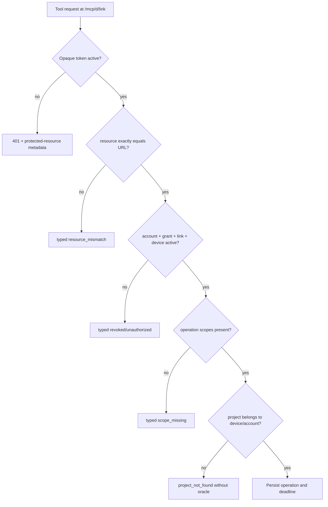

# Security data flows

## Authentication and authorization flow

No error reveals whether a foreign tenant's opaque identifier exists. Validation
queries include the current account and grant from the beginning.

## Stored data by boundary

| Data | Relay PostgreSQL | Relay Redis | Device SQLite | Device OS key store |
|---|---:|---:|---:|---:|
| Account, invitations, browser sessions | Yes | Optional rate counters | No | No |
| OAuth grants/tokens/family/revocation | Yes (hashed token values) | Cache only | Refresh credential only | Protected |
| Device public key/fingerprint/status | Yes | Current epoch routing | Device identity | Private key |
| Project ID/title/root fingerprint/mode/status | Yes | Routing subset | Yes | No |
| Absolute project root | **Never** | **Never** | Yes | No |
| Operation metadata/state/digest/deadline | Yes | Live envelope refs | Yes | No |
| Patch body/command/output | Avoid; encrypted short-lived payload only if required | Bounded TTL | Bounded journal/output | No |
| Audit record | Sanitized 30-day record | No | Local history | No |

## Sensitive data controls

- Persist token and invitation/reset selectors as one-way hashes; keep only the
  one-time presented value in the generated URL.
- Never log Authorization/Cookie headers, WS tickets, key proofs, patch content,
  command arguments, environment values, file content, stdout/stderr, or local
  absolute paths.
- Audit action digests, relative path counts, byte counts, exit status, decisions,
  actor IDs, and reason codes.
- Limit in-memory/Redis payload lifetime and delete terminal payloads after the
  reconnect/diagnostic window.
- Treat traces as logs: span attributes follow the same redaction policy.

## Root identity

The agent binds a project ID to `(volume serial, directory file ID, filesystem
type)` captured from an opened root handle. Each operation opens the configured root
without following reparses, checks this identity, walks components by handles, and
rechecks the final object/parent before I/O or replacement. A mismatch disables the
project until the user re-registers it.
