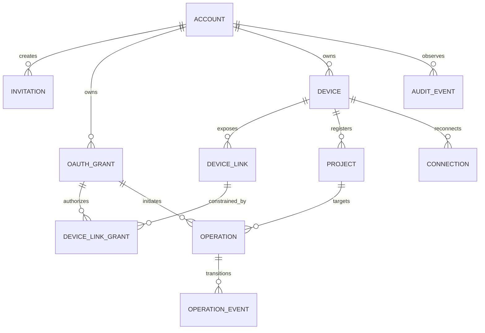

# Relay and agent data model

The implementation's migration names may differ, but these uniqueness and ownership
relationships are contractual.

## Mandatory database constraints

- Tenant-bearing tables include `account_id`; foreign keys cannot cross accounts.
- Active `link_id` is globally unique, random 128-bit data and revocable/rotatable.
- A project is unique by `(device_id, project_id)` and stores a non-path root
  fingerprint. Duplicate titles are valid.
- The current device epoch increases monotonically under a row lock. At most one
  live connection claim exists for `(device_id, epoch)`.
- Patch idempotency is unique for `(account_id, grant_id, device_id, project_id,
  idempotency_key)` and stores request/action digest plus terminal hashes.
- Shell start idempotency detects duplicate submission but never asserts a safe
  replay after an uncertain start.
- Operation transitions append events and conditionally update current state; a
  terminal state is immutable except for a terminal acknowledgment timestamp.
- Token, invite, reset, ticket, and session selectors stored for lookup are hashed.

## Retention

| Record | MVP retention |
|---|---:|
| Sanitized audit events | 30 days |
| Completed operation metadata | 30 days |
| Live request/result payload | Delete promptly after terminal ack; hard TTL 24h |
| Expired access tokens | Cleanup after audit/revocation window |
| Refresh-token family tombstone | At least token lifetime + 30 days |
| Agent shell output | Terminal ack + 60s reconnect grace, then local retention policy |
