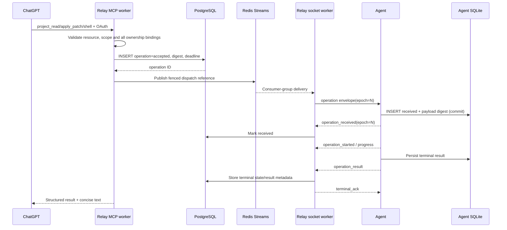
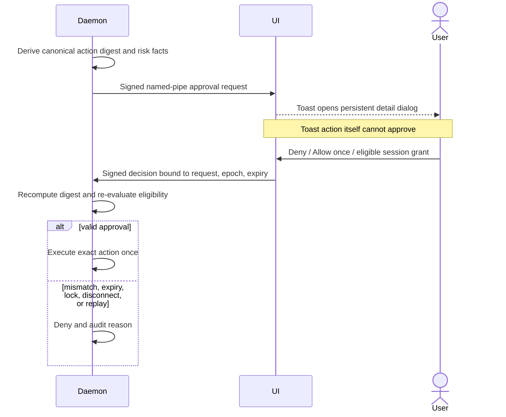

# Critical sequences

## Invite-only account creation

```mermaid
sequenceDiagram
  actor Admin
  participant Relay
  actor User
  Admin->>Relay: Create email-bound invite (24h)
  Relay-->>Admin: Single-use URL (shown once)
  Admin->>User: Deliver manually out of band
  User->>Relay: Open URL and submit email/password
  Relay->>Relay: Constant-time hash lookup; validate email, expiry, unused
  Relay->>Relay: Argon2id password + mark invite consumed atomically
  Relay-->>User: New rotated browser session
  Note over User,Relay: URL possession is not independent email verification
```

## Desktop login and enrollment

```mermaid
sequenceDiagram
  participant Agent
  participant Browser
  participant Relay
  participant CNG as Windows CNG/TPM
  Agent->>Agent: Generate PKCE verifier/challenge and loopback state
  Agent->>Browser: Open system browser authorization URL
  Browser->>Relay: Login + authorize desktop public client
  Relay-->>Agent: Loopback code + state
  Agent->>Relay: Code + verifier + exact redirect URI
  Relay-->>Agent: Short access/rotating refresh tokens
  Agent->>CNG: Create non-exportable signing key
  Agent->>Relay: Enroll public key with authenticated account
  Relay-->>Agent: Device ID and one-time challenge
  Agent->>Relay: Signed challenge
  Relay-->>Agent: Device active; create/rotate MCP link
```

## MCP operation and durable acknowledgment



## Reconnect and fencing

```mermaid
sequenceDiagram
  participant A as Agent
  participant W1 as Worker/socket epoch 41
  participant DB
  participant W2 as Worker/new socket
  A-xW1: Network interruption
  A->>A: Full-jitter backoff; refresh ticket if needed
  A->>W2: WSS + ticket + key proof
  W2->>DB: Atomic epoch 41 -> 42 and claim connection
  DB-->>W2: epoch 42
  W2-->>A: welcome(epoch=42)
  W1->>DB: Attempt result at epoch 41
  DB-->>W1: fenced; reject and close
  A->>W2: Resume journal/output state for epoch 42
```

## Managed frontend inspection loop

```mermaid
sequenceDiagram
  participant GPT as MCP client / ChatGPT
  participant Relay
  participant Agent
  participant Dev as Loopback dev server
  participant Browser as Codito Chromium
  GPT->>Relay: frontend_session_start(project, route, viewport)
  Relay->>Relay: Verify project + frontend:interact + shell:execute
  Relay->>Agent: project_frontend/session_start
  Agent->>Agent: Resolve local config + approval/bindings
  alt configured origin is ready
    Agent->>Dev: Reuse; do not claim ownership
  else not ready
    Agent->>Dev: Start broker-contained process tree
    Agent->>Dev: Poll bounded HTTP readiness
  end
  Agent->>Browser: Launch project profile + relative route
  Agent-->>GPT: session_id + sanitized URL
  GPT->>Relay: frontend_snapshot(session)
  Agent->>Browser: Viewport PNG + DOMSnapshot + AX tree
  Agent-->>GPT: MCP image + snapshot_id + e1..eN
  GPT->>Relay: inspect/source/act(snapshot_id, eN)
  Agent->>Agent: Recheck grant/link/project/root/epoch/generation
  Agent->>Browser: Bounded CDP query or interaction
  Agent-->>GPT: Evidence or completed + snapshot invalidated
  GPT->>Relay: frontend_session_stop(session)
  Agent->>Browser: Close context
  opt server was agent-owned and unreferenced
    Agent->>Dev: Terminate contained process tree
  end
```

Navigation, HMR, every action, disconnect, expiry, or local security change makes
an old snapshot registry unusable. Start and act are never automatically replayed
after an uncertain outcome.

## Approval



## Shell approval continuation

```mermaid
sequenceDiagram
  participant GPT as MCP client / ChatGPT
  participant Relay
  participant Agent
  participant UI as Windows approval UI
  actor User
  GPT->>Relay: project_shell(start)
  Relay->>Agent: operation over outbound WSS
  Agent->>Agent: Create durable job_id; state=pending_approval
  Agent->>UI: Request local approval
  par bounded start wait
    Agent->>Agent: Wait on state-change condition (<=30s)
  and user decision
    UI-->>User: Show approval
    User->>UI: Allow / deny
  end
  alt decision arrives inside bounded wait
    Agent-->>Relay: Same job_id, queued/running/terminal
    Relay-->>GPT: Start result
  else decision takes longer
    Agent-->>Relay: Same job_id, pending_approval
    Relay-->>GPT: Start result
    loop while job is non-terminal
      GPT->>Relay: project_shell(poll, same job_id, wait=30s)
      Relay->>Agent: Poll over WSS
      Agent-->>Relay: Current state + sequenced output
      Relay-->>GPT: Poll result
    end
  end
  Note over GPT,Agent: Never resubmit start to continue the same intended action.
```

When a client explicitly advertises the official `io.modelcontextprotocol/tasks` extension,
Codito can later expose the same durable state through a Tasks adapter. The shell-job path above
remains the compatibility path for clients that do not negotiate Tasks.
