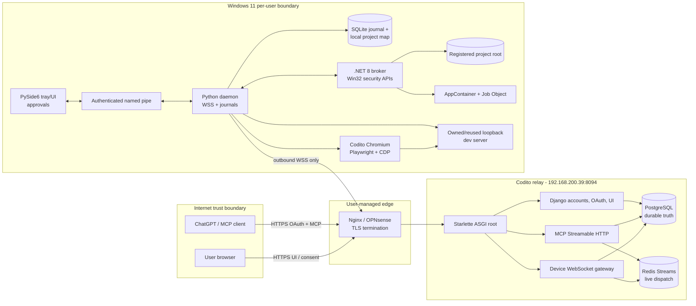

# System architecture

## Context

Codito lets an authorized ChatGPT session invoke bounded operations against a
project registered on a particular user's Windows device. The relay is a control
and routing plane; the device is the filesystem and execution authority.

## Relay modules

| Module | Responsibility | Durable state |
|---|---|---|
| Accounts | Invite, password, session, admin bootstrap/reset | PostgreSQL |
| OAuth | Discovery, authorization, consent, tokens, CIMD/JWKS | PostgreSQL + signing key configuration |
| Registry | Devices, links, projects, revocation, status | PostgreSQL |
| MCP | Focused tool catalog, auth context, input/result translation | Operations in PostgreSQL |
| Gateway | Proof-bound device sockets, connection epochs, envelope checks | PostgreSQL + Redis |
| Dispatch | Admission, deadlines, queues, concurrency, notification | PostgreSQL + Redis Streams |
| Audit | Redacted security/event history and retention | PostgreSQL |
| Dashboard | Server-rendered HTMX account/device/project/audit views | No separate state |

The top-level Starlette router mounts modules without making Django state optional.
The MCP application is sessionless from Codito's perspective; business operation
state is explicit in PostgreSQL rather than hidden in an ASGI worker.

## Device modules

| Module | Responsibility |
|---|---|
| Connection manager | Ticket refresh, WSS, heartbeat, jitter reconnect, epoch state |
| Operation journal | Persist-before-ack, deduplication, crash recovery, terminal acks |
| Project registry | Local root map, identity fingerprints, execution mode |
| Path resolver | Lexical rejection plus handle-based containment/reparse verification |
| Read engine | Bounded directory/read/search operations and continuation cursors |
| Patch engine | Exact parser, all-file preflight, journaled atomic commit/recovery |
| Shell supervisor | Start/poll/cancel, output sequencing/caps, reconnect grace |
| Policy engine | Local modes, approval eligibility, expiring session grants |
| UI bridge | Mutually authenticated named-pipe messages and signed approval dialogs |
| Broker client | Narrow request protocol to .NET boundary; fail-closed self-test |
| Frontend runtime | Own/reuse a loopback dev server and manage project-scoped Chromium sessions |
| Browser inspector | Viewport PNG, snapshot-bound semantic registry, CDP styles/layout/a11y, bounded interaction and validated source mapping |

## Trust invariants

1. A link ID is public routing data. It never grants access.
2. An OAuth token is insufficient unless its account, active grant, resource,
   scopes, link, device, and project all agree with server state.
3. The relay cannot select or reconstruct a local absolute path.
4. The model cannot select local trust or approve its own request.
5. A stale socket cannot complete a new-epoch operation.
6. The relay records an operation before publishing it; the device records it before
   acknowledging it.
7. An isolated command never silently becomes native.
8. Frontend element IDs never outlive their snapshot, and page-supplied source
   metadata never bypasses project path validation.

## Scale and availability

The MVP runs two ASGI workers, one PostgreSQL instance, and one Redis instance.
Each relay worker uses a bounded ORM executor (eight lanes by default) and one
shared bounded asynchronous Redis pool; MCP and WebSocket waits stay on the event
loop. Workers are stateless with respect to socket routing beyond their live
connection; epoch ownership and Redis
notifications coordinate them. Agent operation tasks run concurrently, while the
read scheduler permits eight reads globally and four per project by default. The
mutation gate is keyed by project so unrelated projects do not share a write lock.
The device WebSocket send lock preserves envelope ordering, so shell output is paged
to keep a noisy project from delaying small results for another project. This removes
sticky MCP sessions but does not make the single host highly available. PostgreSQL
or Redis outages make readiness fail and admission stops safely.
