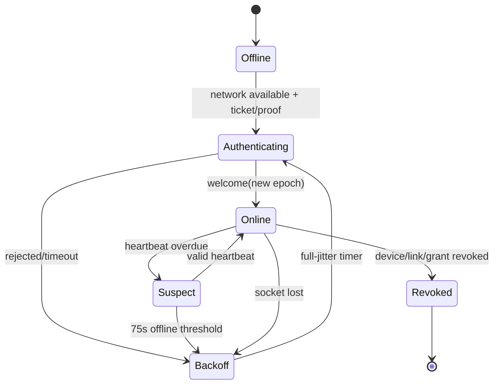
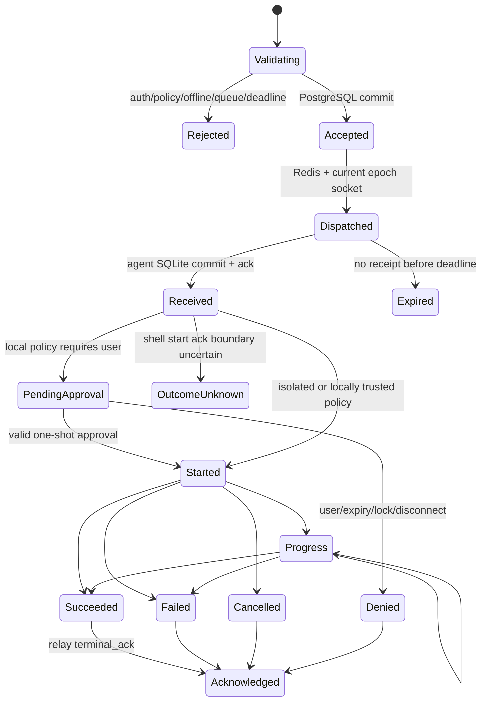
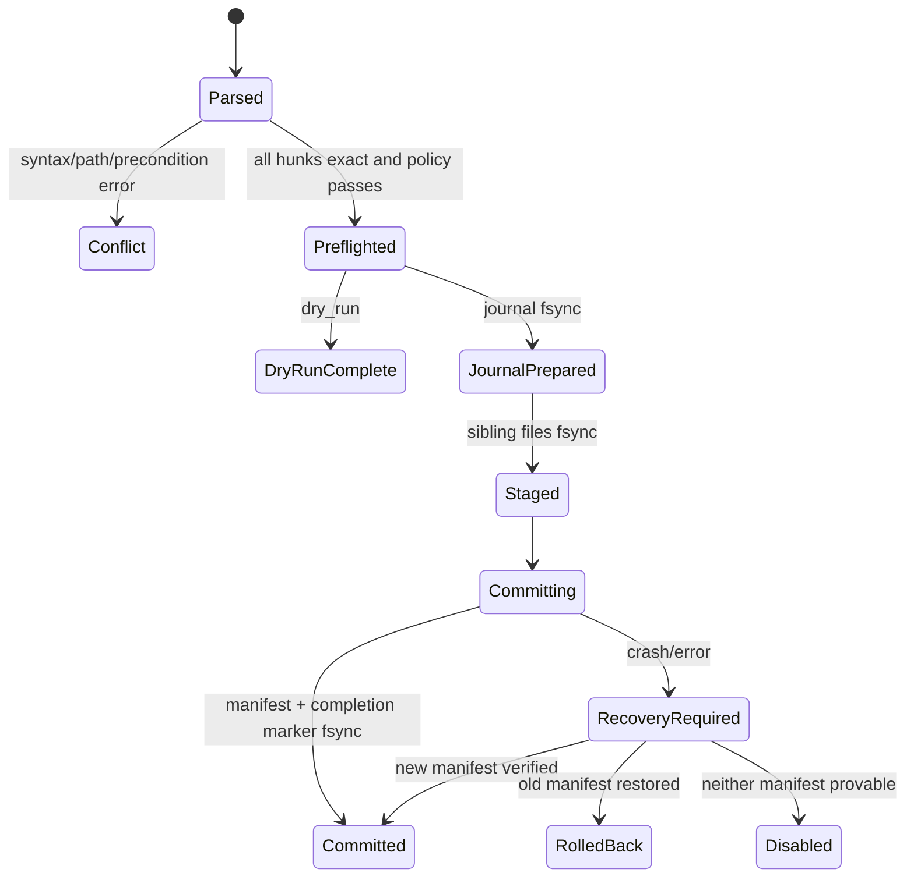
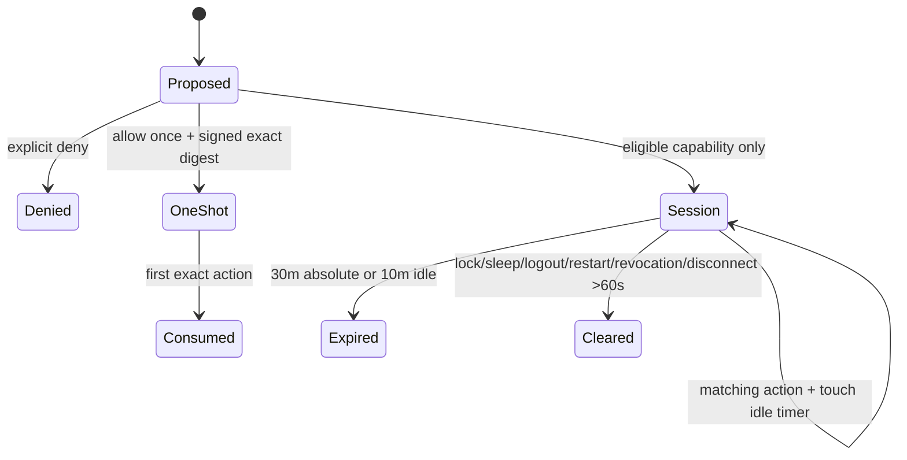

# State machines

## Device connection

## Operation

Terminal state is immutable. `outcome_unknown` never transitions to retry; a later
reconciliation may attach evidence but cannot pretend the first command did not run.

## Patch transaction

## Approval grant

